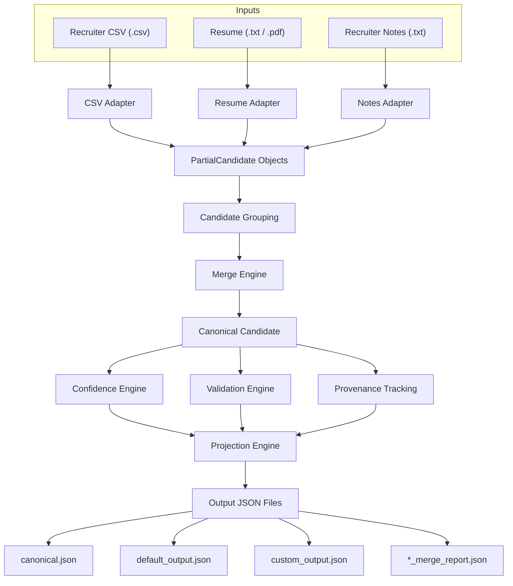
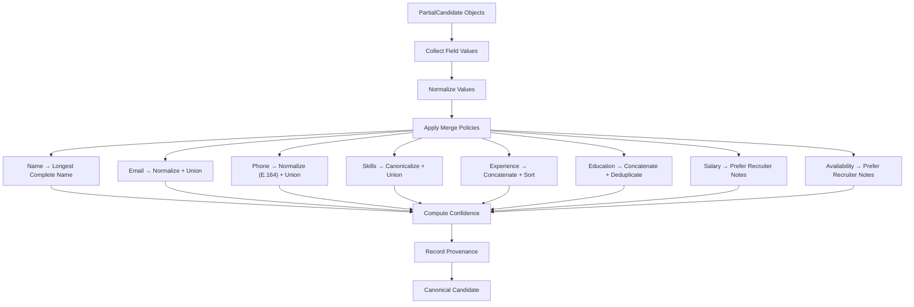

# Candidate Data Transformation Pipeline

A deterministic ETL-style pipeline that consolidates structured recruiter exports, resume text, and recruiter notes into a unified canonical candidate profile.

The pipeline ingests data from multiple heterogeneous sources, extracts candidate information, normalizes and merges overlapping fields, computes confidence scores, tracks provenance, validates the merged profile, and finally projects the canonical representation into configurable output schemas.

---

# Features

- Multi-source candidate ingestion
  - Recruiter CSV
  - Resume 
  - Recruiter Notes

- Deterministic information extraction

- Canonical candidate representation

- Rule-based merge engine

- Skill canonicalization

- Confidence scoring

- Provenance tracking

- Configurable output projection

- Data validation

- Explainable merge reports

---

# Architecture

## System Architecture


---

# Project Structure

```
Candidate_data_transformer/
│
├── config/
│   ├── default_config.json
│   └── custom_config.json
│
├── sample_input/
│
├── output/
│
├── tests/
│   ├── sample_cases/
|   │   ├── recruiter_notes/
|   │   ├── resumes/
|   │   └── recruiter.csv
├── src/
│   ├── adapters/
│   ├── extractors/
│   ├── confidence.py
│   ├── merger.py
│   ├── normalizer.py
│   ├── projector.py
│   ├── validator.py
│   ├── report.py
│   ├── constants.py
│   ├── models.py
│   └── main.py
│
├── requirements.txt
└── README.md
```

---

# Design Decisions

## Rule-Based Processing

A deterministic rule-based approach was intentionally chosen over
probabilistic or LLM-based extraction to satisfy the assignment's
requirements for reproducibility, explainability, and consistent outputs.

Given identical inputs, the pipeline always produces identical results.

## PartialCandidate → CanonicalCandidate

Each input source provides only partial information.

Rather than forcing every adapter to populate the complete schema, every adapter produces a `PartialCandidate`. These partial representations are merged into a single `CanonicalCandidate`.

This keeps adapters independent and makes the merge process deterministic.

---

## Deterministic Processing

The assignment requires deterministic behavior.

No Large Language Models or probabilistic inference are used.

Every extraction, normalization, merge, and validation step is rule-based and produces identical output for identical input.

---

## Projection Layer

The internal canonical representation remains fixed.

Consumers can define arbitrary output schemas using configuration files without changing the merge logic.

---

## Provenance Tracking

Every merged field stores:

- originating source
- merge method
- confidence

This makes every transformation explainable.

---

# Merge Policies
## Merge Engine



| Field | Merge Strategy |
|--------|----------------|
| Full Name | Longest complete name |
| Email | Normalize + Union |
| Phone | Normalize (E.164) + Union |
| Skills | Canonicalize + Union |
| Experience | Concatenate + Sort |
| Education | Concatenate + Deduplicate |
| Salary | Prefer Recruiter Notes |
| Availability | Prefer Recruiter Notes |
| Location | First Available |
| Headline | First Available |

---

# Confidence Scoring

Field confidence is computed deterministically using:

- Source reliability
- Validation status
- Successful normalization
- Cross-source agreement

Overall confidence combines:

- Average field confidence
- Candidate profile completeness

This prevents partially populated profiles from receiving unrealistically high confidence scores.

---

# Provenance

Each merged field records:

- Originating source(s)
- Merge strategy used
- Field confidence

This allows every value in the canonical profile to be traced back
to its origin.

Example:

```json
{
    "field": "skills[Python]",
    "source": "resume+notes",
    "method": "canonical_union"
}
```

---

# Validation

The validation engine performs non-blocking quality checks.

Current validations include:

- Missing name
- Missing email
- Missing phone
- Email format validation
- Phone format validation
- Duplicate emails
- Duplicate phones
- Duplicate skills
- Empty skill entries
- Missing company in experience
- Missing title in experience
- Missing institution in education
- Missing degree in education
- Salary format sanity check

Warnings are reported without stopping pipeline execution.

---

# Generated Outputs

Running the pipeline generates:

```
output/
│
├── canonical.json
├── default_output.json
├── custom_output.json
├── aditi-sharma-gmail-com_merge_report.json
└── rohan-verma-example-com_merge_report.json
```

Where:

- **canonical.json** contains the unified canonical representation.
- **default_output.json** contains projection using the default configuration.
- **custom_output.json** contains projection using the custom configuration.
- **merge_report.json** documents every merge decision.

---

# Example Execution

```bash
python src/main.py \
    --csv sample_input/recruiter.csv \
    --resume sample_input/resume.txt \
    --notes sample_input/recruiter_notes.txt \
    --config config/custom_config.json
```

---

# Assumptions

- Each resume belongs to one candidate.
- Recruiter notes belong to one candidate.
- CSV may contain multiple candidates.
- Matching across sources assumes a shared identifier (typically email).
- Unknown skills are preserved.
- Missing information produces warnings instead of terminating execution.
- Text-based PDF resumes are supported.

---

# Limitations

- Text-based PDF resumes are supported. Scanned or image-only PDFs are not currently supported because OCR is intentionally excluded to keep the pipeline deterministic.
- Rule-based extraction may miss highly unconventional resume formats.
- English-language resumes are assumed.
- Candidate grouping primarily relies on consistent identifiers (email, and name as a fallback where available).
- Batch processing assumes that recruiter CSV, resumes, and recruiter notes contain consistent identifiers. Inconsistent or missing identifiers may result in standalone candidate profiles instead of automatic merging.
- Experience and education extraction currently use deterministic pattern matching and may not capture every resume layout.

---

# Future Improvements

- OCR support for scanned resumes
- Entity resolution across multiple recruiter exports
- More sophisticated confidence calibration
- Additional configurable merge strategies
- REST API for pipeline execution
- Batch processing support
- Extended validation rules
